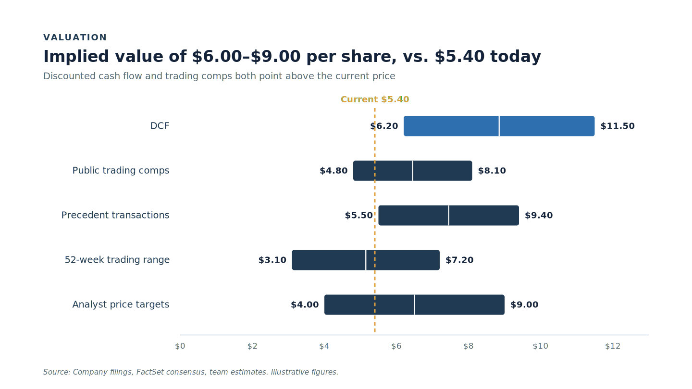

# Football field (valuation range)

**What it is.** A horizontal floating-bar chart showing the implied per-share value from each
valuation methodology, with a reference line for the current price. The standard way to show a
valuation conclusion as a range rather than a false-precision point.

**When to use.** The valuation slide of a stock pitch or the finance section of a case when the
answer is "worth $X to $Y". One methodology per row.

**Anatomy.**
- Kicker + action title stating the implied-value conclusion.
- One floating bar per method; low and high labelled directly at the bar ends.
- Method names on the left (no legend).
- White centre tick marks the midpoint of each range.
- Amber dashed vertical line = current price, labelled at the top.
- The methodology that anchors the thesis is the hero (accent `#2E6FB0`); the rest navy.
- Source line bottom-left.

**To reskin / re-data.** Edit the SVG directly. Geometry: x domain $0..$13 maps to x 250..900,
so `x = 250 + value * 50`. To change the domain, change the 50 (= plotWidth / maxDollar) and the
axis tick labels. Each row is a `<rect>` plus two `<text>` end labels plus a white midpoint
`<line>`. Swap the hero by moving the `#2E6FB0` fill to a different row.

**Narrative line to supply when requesting a variant.** Which method is the hero, and whether the
takeaway is "upside to current" or "downside to current" (flips the colour story).

**Activist variant (todo).** Black bars, signal-yellow hero and current-price marker.
