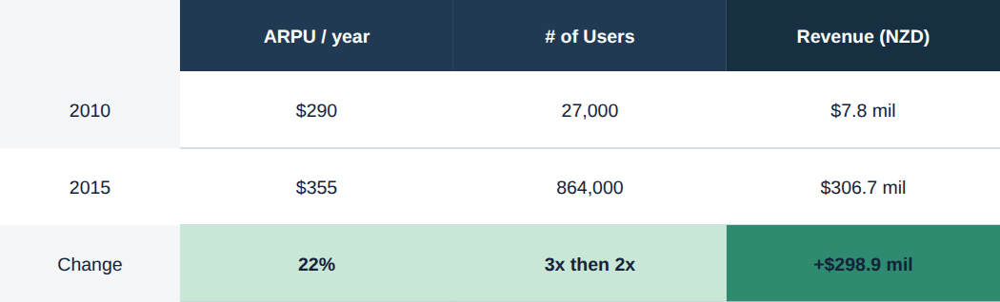

# Build-up table

**What it is.** A bottom-up arithmetic table that shows how a headline number is built, e.g.
ARPU &times; users = revenue, with a green-highlighted "Change" row and a navy header band
(`ref01`). The reader should be able to reconstruct the number from the row above it.

**When to use.** Any exhibit whose job is to prove a number by showing its components: a revenue
build, a cost build, a headcount build. Pair with a `TakeawayStrip` underneath for a complete
finance exhibit.

**Anatomy.**
- Label column (leftmost): panel-grey background on every row, centred text, no header fill.
- Data column headers: navy (`#1F3A52`), except `heroColumn` (the headline result, e.g. Revenue),
  which gets the deeper `navy-deep` (`#163041`) so the result column reads as the destination.
- Data rows: white background, centred text, tabular numerals, hairline rule under each row
  (rule spans the data columns only, not the label column).
- The `change` row (the delta/CAGR row): bold text, light green background (`#C9E7D6`) on regular
  columns, solid green (`#2E8B6F`) on the hero column.

**Known quirk to carry forward.** The source component keeps text colour as ink (`#14233A`) even
on the solid-green hero cell in the change row; contrast there is moderate, not high. This is
copied faithfully from the ground-truth component rather than "fixed", per the system's rule to
match the source exactly (`docs/BUILDER_SKILL.md`) &mdash; flag it if a real deck needs stronger
contrast on that cell.

**To reskin / re-data.** Edit the header/`heroColumn` fills and the row `<text>` values directly;
keep the label column's centred panel-grey treatment and the change row's green highlight.

**Narrative line to supply when requesting a variant.** Which column is the headline result
(`heroColumn`) and which row (if any) is the change/delta row.
