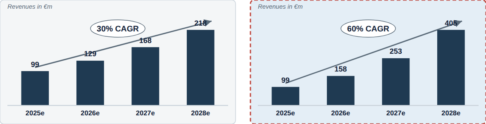

# Scenario bars

**What it is.** A compact navy bar chart for one scenario, with direct value labels on top and an
oval "X% CAGR" annotation with an arrow sweeping across the bars (`ref08`).

**When to use.** Stack two or more of these down a slide (or across it) to compare scenarios,
each paired with a short bullet list to its side. Ring the recommended scenario's panel with the
`highlight` treatment.

**Anatomy.**
- Panel: light grey background (`#F4F6F7`), 1px gridline border, 6px corner radius.
- `highlight` panel: pale blue background (`#E4EEF6`), 2px dashed border in the reserved
  negative/red (`#C0473E`) &mdash; this is the fixed highlight treatment in the source component,
  not a semantic "risk" signal.
- Bars: solid navy, no rounding, direct value label above each bar, category label below.
- CAGR annotation: a slate arrow from just above the first bar to just above the last, with an
  oval chip carrying the CAGR figure roughly centred over the run.
- Optional italic unit note top-left (e.g. "Revenues in &euro;m").

**To reskin / re-data.** Recompute each bar's `height` from `y(v) = padTop + plotH - (v / (max *
1.1)) * plotH` where `max` is the largest value in that panel only (each panel scales to its own
data, so two panels are not directly comparable by bar height alone; the CAGR chip carries the
comparison). Duplicate the whole panel group and translate it horizontally (or stack vertically)
for additional scenarios.

**Narrative line to supply when requesting a variant.** The CAGR figure per scenario and which
scenario (if any) should carry the `highlight` treatment.
