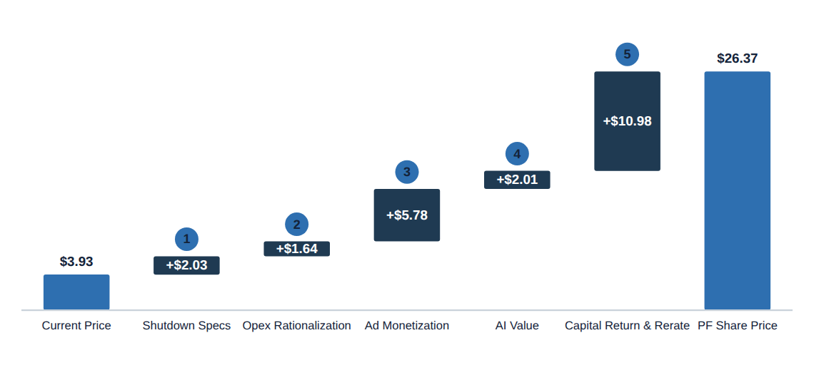

# Waterfall

**What it is.** A bridge chart that builds a total from a start value through signed deltas to an
end value: floating delta bars with direct value labels, endpoint bars in the hero accent, and
optional numbered step chips tying each delta to a narrative point (`ref04`). Shows the
arithmetic, start &rarr; +deltas &rarr; end, so the reader can reconstruct the number.

**When to use.** Any bridge: share-price walk, cost build-up, EBITDA bridge, headcount build.

**Anatomy.**
- Start and end bars are the hero accent (`#2E6FB0`); every delta bar in between is navy
  (`#1F3A52`) regardless of sign, since colour here means "endpoint", not "gain/loss".
- Delta value labels sit inside the bar in white; endpoint value labels sit above the bar in ink.
- Numbered chips (accent circle, ink digit) float above a delta bar when the step needs to tie to
  a narrative list elsewhere on the slide.
- Category labels sit on a shared baseline; no gridlines, no axis numbers (the bars are already
  directly labelled).

**To reskin / re-data.** Each bar's `y`/`height` comes from the running total: `to = from + delta`,
then map both `from` and `to` through `y(v) = padTop + plotH - (v / (max * 1.12)) * plotH` with
`max` = the largest running total across the whole bridge. Keep bar width at 60% of its slot.
Recolour a delta bar only if you're deliberately breaking the "navy for deltas" rule (not
recommended; use the chip instead to call out a specific step).

**Narrative line to supply when requesting a variant.** The start and end labels, the ordered list
of deltas, and whether any steps need numbered chips to match a bullet list elsewhere on the slide.

**Alternate treatment (todo): sideways.** The user has flagged a preference for a waterfall
flipped on its side, a vertical stack of horizontal lever bars connecting to a running total, with
an annotation column on the right (`ref10`; see `docs/CHART_RULES.md` rule 18). Not yet built as
its own component; build it as a variant here or as a sibling `waterfall-horizontal/` when a real
use case needs it.

**Activist variant (todo).** Endpoints become signal yellow (`#F5E003`) on a black bar; deltas
stay black rather than navy.
