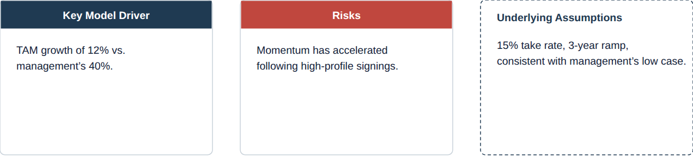

# Callout

**What it is.** A labelled box that pulls one idea out of the flow. `tone` sets the meaning:
neutral (navy header, default), positive, negative, or caution. `border="dashed"` turns it into
an assumption / annotation box instead of a solid info box (`ref02`, `ref08`).

**When to use.** Solid: a coloured-header info or risk box beside a model or thesis (`ref07`).
Dashed: an "Underlying Assumptions" note attached to a chart (`ref02`) or the highlighted
scenario in a set (`ref08`).

**Anatomy.**
- Solid: coloured header bar (tone colour, centred white/ink text, bold 13px) &middot; 1px
  gridline border around the whole card &middot; 6px corner radius &middot; body text 13px ink.
- Dashed: no header fill; the title sits left-aligned in the tone colour; the whole card gets a
  1px dashed border in that same tone colour instead of a solid gridline border.
- Semantic tones (positive/negative/caution) are reserved for actual gain/loss/caution meaning;
  use neutral (navy) for a plain info box.

**To reskin / re-data.** Swap the header fill / dashed-stroke colour for the tone: neutral
`#1F3A52`, positive `#2E8B6F`, negative `#C0473E`, caution `#E0A13C` (caution's body/title text
uses ink `#14233A`, not white, since the fill is light). Edit the title and body `<text>`
directly; wrap body copy manually at roughly 30 characters per line at this width.

**Narrative line to supply when requesting a variant.** What the callout is annotating (a driver,
a risk, an assumption) and whether it needs a semantic tone or stays neutral.
