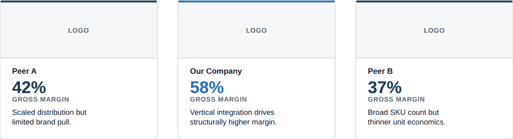

# Comparison card

**What it is.** A card in a comparison / competition grid: an accent top-border, a logo/media
slot, a hero stat, and a short descriptor (`ref06`).

**When to use.** Peer-comparison or competitive-landscape slides, laid out as a row or grid of
3&ndash;5 cards.

**Anatomy.**
- 1px gridline border, 6px corner radius, 3px accent-coloured top border.
- Media slot: 92px tall, panel-grey background, bottom hairline &mdash; drop a real company logo
  or product shot in here; never redraw one.
- Title (13px bold ink) &middot; stat (28px/800, coloured) &middot; stat label (11px uppercase,
  tracked, slate) &middot; a 1&ndash;2 line descriptor (12.5px ink).
- **Grey the field, colour the hero:** only the card that carries the argument gets the accent
  top-border and accent-coloured stat; every peer card uses navy for both.

**To reskin / re-data.** Duplicate a card block (the `<rect>`/`<line>`/`<text>` group), shift its
`x` by 294px per column, and edit the title/stat/label/descriptor strings. Change the top-border
`fill` and the stat `<text>` `fill` together when moving the hero to a different card.

**Narrative line to supply when requesting a variant.** Which entity is the hero of the
comparison, and the one stat that should carry the argument for each card.
