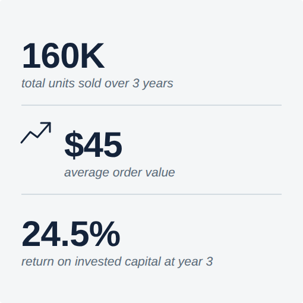

# KPI tile

**What it is.** One loud number with a short descriptor, optionally a thin monochrome line icon
to its left. The figure that carries the message is the largest type on the slide; everything
else supports it.

**When to use.** Stacked two or three deep in a right-hand KPI panel beside a chart (`ref03`), or
laid out in a row of three under a table (see the Auckland-style `kpi-row3` pattern).

**Anatomy.**
- Value: 40px/800 ink, tight tracking (&minus;0.5px).
- Label: 14px italic slate, directly under the value.
- Optional icon: thin monochrome line icon (2px stroke, ink), sized to sit beside the number,
  never filled or multicolour. Prefer no icon &mdash; a labelled number beats a decorative glyph.
- When stacking tiles in a panel, separate them with a 1px gridline rule, not extra padding alone.

**To reskin / re-data.** Edit the value/label `<text>` strings directly; keep the two font sizes
and the ink/slate colour split. To add an icon, draw a simple 2px-stroke line glyph in `#14233A`
at a ~32x32 box to the left and shift the value/label text right to clear it (see tile 2). Delete
the divider `<line>` elements if only one tile is needed.

**Narrative line to supply when requesting a variant.** Which KPI is the headline number if more
than one tile is shown (there should still be only one loudest figure on the slide overall).
