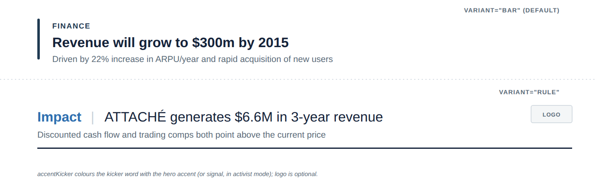

# Action title

**What it is.** The slide headline. MBB rule: an action title states the **conclusion**, not the
category &mdash; "Revenue will grow to $300m by 2015", never just "Revenue". The title is the
argument; the exhibit beneath it is the evidence.

**When to use.** As the top of every exhibit slide. Two treatments are in the system:
- `variant="bar"` (default) &mdash; a thick navy vertical rule, a `Kicker`, then the title. See `ref01`.
- `variant="rule"` &mdash; an inline "Kicker | Title" line with a hairline rule underneath and an
  optional logo slot on the right. See `ref03` / `ref07`.

**Anatomy.**
- **bar**: 4px navy rule (full height of the text block) &middot; kicker above the title &middot;
  22px/700 title &middot; optional 14px slate subtitle underneath.
- **rule**: 22px/700 kicker in navy or accent &middot; a gridline-grey "|" divider &middot; 22px/400
  title inline &middot; optional logo slot top-right &middot; optional subtitle &middot; a 2px
  ink-coloured hairline rule under the whole block.
- Keep the title to one line where possible; it should read in under three seconds.

**To reskin / re-data.** Both variants are plain `<text>`/`<rect>`/`<line>` elements: edit the
title/kicker/subtitle strings directly. For `bar`, the rule height should span the kicker+title
block. For `rule`, resize the hairline rect's `width` to match your title's actual text length,
and drop the logo `<rect>`/`<text>` pair entirely if there's no logo. Colour the kicker word with
accent (`#2E6FB0`) only when `accentKicker` applies (or signal `#F5E003` in activist mode).

**Narrative line to supply when requesting a variant.** The one-sentence conclusion the title
should state, and whether a logo or subtitle is needed.
