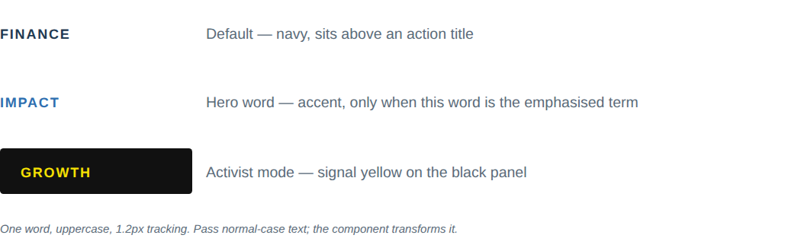

# Kicker

**What it is.** The small uppercase, tracked category label that sits above an action title:
"FINANCE", "VALUATION", "IMPACT". One word (occasionally two), never a sentence.

**When to use.** As the first line of any headline block (see `ActionTitle`), or inline as an
emphasised lead word ("**Impact** | ATTACHÉ generates $6.6M...").

**Anatomy.**
- Uppercase, 12px, semibold, 1.2px letter-spacing.
- Navy by default (`#1F3A52`).
- Accent (`#2E6FB0`) only when the kicker word itself is the hero, not a section label.
- Activist mode: signal yellow (`#F5E003`) set on the solid black panel (`#111111`), never on white.

**To reskin / re-data.** It's a single `<text>` element: change the string, keep the size/weight/
tracking. Swap `fill` between navy, accent, or signal-on-black per the rules above. Do not
lowercase or add punctuation.

**Narrative line to supply when requesting a variant.** Whether this kicker is a plain section
label (navy) or the one hero word in the headline (accent) &mdash; determines the colour.
