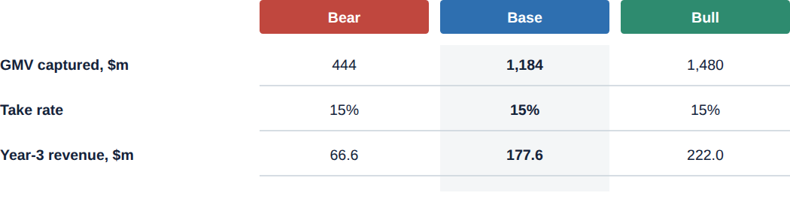

# Scenario table

**What it is.** The bear / base / bull table: coloured column headers with aligned numeric rows
underneath (`ref07`). The house's standard way to show a three-case scenario range.

**When to use.** Price-target tables, scenario/sensitivity summaries, any three-case comparison
(e.g. the Auckland-model UK expansion bear/base/bull breakdown this example uses).

**Anatomy.**
- Column header names and colours are **fixed**: Bear = negative red (`#C0473E`), Base = accent
  blue (`#2E6FB0`), Bull = positive green (`#2E8B6F`). White bold text, 3px rounded pill.
- Row label column is left-aligned and unstyled (no header pill).
- Numeric cells are centred, tabular numerals.
- The hero column (usually Base) gets a faint panel-grey (`#F4F6F7`) background and bold values
  across every row, a subtle way to point at the recommended case without extra colour.
- Horizontal rule only under each data row; no outer border, no vertical lines.

**To reskin / re-data.** Edit the row label and the three value `<text>` elements per row; keep
the 40px row pitch and the hero-column shading `<rect>` spanning the full row block. Don't
recolour the Bear/Base/Bull headers; that mapping is fixed across the system.

**Narrative line to supply when requesting a variant.** Which column is the hero (usually Base,
but not always) and the row set to include.
