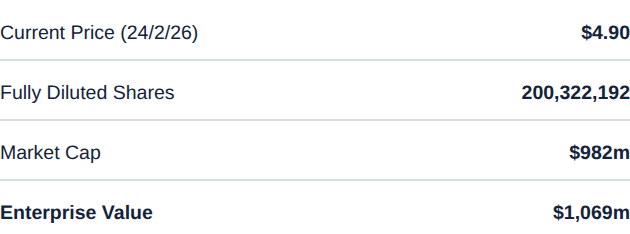

# Stat table

**What it is.** A clean two-column label/value list: Current Price, Shares, Market Cap, Enterprise
Value. The plainest table in the system.

**When to use.** Quick key-stat summaries at the top of a thesis or valuation slide (`ref07`).

**Anatomy.**
- Left column: label, regular weight, left-aligned.
- Right column: value, semibold, right-aligned, tabular numerals so decimals line up.
- 1px gridline hairline under every row. No outer border, no zebra striping, no vertical lines.
- The final/total row (`emphasis`) bolds both label and value.

**To reskin / re-data.** Duplicate a label/value/rule group per row (36&ndash;40px pitch) and edit
the strings. Keep the unit consistent down the value column; only the emphasis row goes bold.

**Narrative line to supply when requesting a variant.** Which row (if any) is the emphasised
total or conclusion figure.
